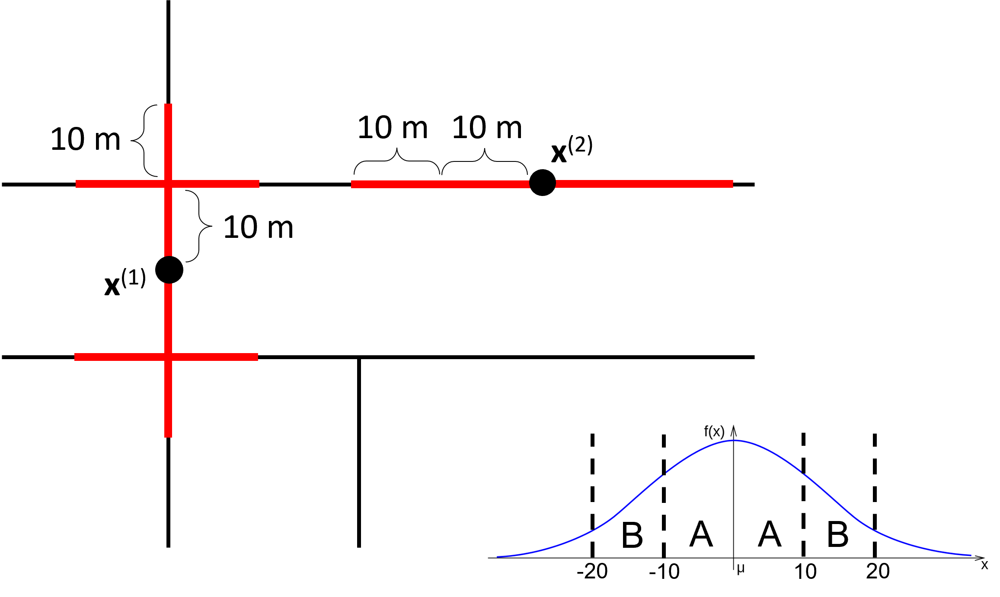
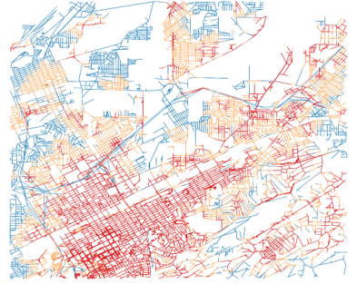
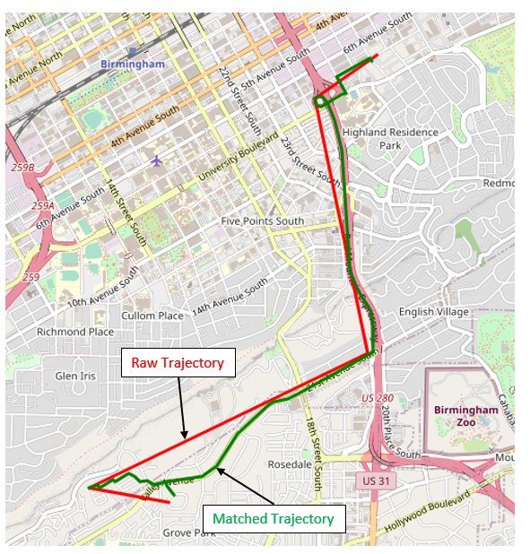
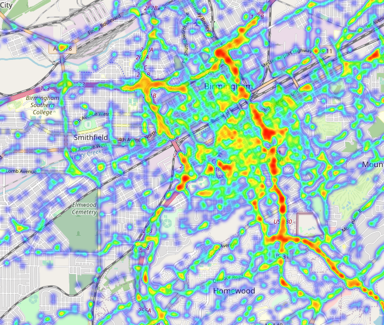

## Realistic Urban Traffic Simulation with Ride-Hailing Services: A Revisit to Network Kernel Density Estimation

    <strong>Realistic Urban Traffic Simulation with Ride-Hailing Services: A Revisit to Network Kernel Density Estimation (Systems Paper)</strong> 
    (Best Paper candidate 🙌)

    <a href="https://doi.org/10.1145/3557915.3560963">🔗 Link</a> | 
    <a href="https://youtu.be/cvTtre3mnHE">📺 YouTube</a>

    Presented at the International Conference on Advances in Geographic Information Systems (ACM SIGSPATIAL 2022)

## Abstract
App-based ride-hailing services, such as Uber and Lyft, have become
popular thanks to technology advancements including smartphones
and 4G/5G network. However, little is known about to what degree
their operations impact urban traffic since Transportation Network
Companies seldom share their ride data due to business and user
privacy reasons. Recently, transportation engineering researchers
begin to collect data in some large cities trying to understand the
transportation impacts of ride-hailing services, to assist transportation planning and policy making. However, (1) there does not exist
a general data collection approach applicable to any city, and (2) the
studies were based on historical data and cannot project the future
easily even though ride-hailing services are developing quickly.
In this paper, we introduce our approach to building a digital
twin of the transportation in the medium-sized city of Birmingham,
Alabama. This digital twin is a transportation simulation model
that incorporates transportation modes such as public transits and
ride-hailing services, in addition to private vehicles that constitute the majority of Birmingham’s traffic. With this digital twin,
transportation engineers can flexibly analyze the impact of ridehailing services under different scenarios, such as if the number of
Uber drivers doubles which could happen in the near future. The
digital twin may also enable new opportunities, such as being an
environment for learning policies with reinforcement learning.
To enable realistic transportation simulation, we propose a novel
approach to collect Uber ride data that is easy to carry out in any
city. This approach collects app screenshots on Uber rides from Uber
drivers, and uses crowdsourcing to postprocess these screenshots
to extract detailed ride information. We then fit a spatiotemporal
distribution of Uber rides using the collected data via network kernel density estimation (KDE). The existing network KDE method is
flawed in that the contribution of data samples are not the same, so
we propose a new formulation to overcome this problem. The distribution combined with population statistics from census data enable
the generation of realistic Uber rides for agent-based simulation.

  
  &nbsp;&nbsp; 
  

## Map Matching
After obtaining all the extracted ride trajectories, we map them
to the underlying road network obtained from OpenStreetMap, using the [FMM](https://github.com/cyang-kth/fmm)
library for trajectory map matching. Figure below shows
a raw trajectory extracted as a sequence of
points plotted with a red polyline, and the map-matched trajectory
plotted with a green line. We can see that the map-matched trajectory is along the roads and highways, which is properly recovered
from the sparse set of raw trajectory points.

  

## Visualization using HeatMap

We next present some visualization results to summarize our
extracted trajectories. We uniformly sampled 100,000 points from
the trajectories after map matching, and plotted a heat map using
Python’s Folium library. Here, we sample points since plotting
the heat map using all trajectory points is too costly for Folium.

  

## Visualization using D3
### [Click here for demo](https://inspiring-fox-a56ec4.netlify.app/)

We also grouped rides by origin-destination (OD) zipcode areas
(defined by TigerWeb6
) and created an outbound and an inbound
trip D3.js interactive visualization. Figure below shows the outbound
trip visualization, where a count-threshold bar is used to filter out
edges (origin-zipcode, destination-zipcode, count) with low counts,
and the darker blue an area is, the more ride origins it contains.
The top figure shows the outbound edges from zipcode area 35233
(UAB) highlighted in red, and the bottom figure is when we raise
the count-threshold to the highest level, where we can see that UAB
and the airport are two biggest ride hotspots.

  

## Visualizing MATSim Results using Via
https://simunto.com/via/

Click on the images below to go to the YouTube videos.

Urban Traffic Simulation with Ride-Hailing Services around 6:00 PM

  

 

Urban Traffic Simulation with Ride-Hailing Services around 9:00 PM

  

<h2>Citation</h2>

If you use this work, please cite the following paper:

<pre>
@inproceedings{khalil2022realistic,
  title={Realistic urban traffic simulation with ride-hailing services: a revisit to network kernel density estimation (systems paper)},
  author={Khalil, Jalal and Yan, Da and Yuan, Lyuheng and Jafarzadehfadaki, Mostafa and Adhikari, Saugat and Sisiopiku, Virginia P and Jiang, Zhe},
  booktitle={Proceedings of the 30th International Conference on Advances in Geographic Information Systems},
  pages={1--10},
  year={2022}
}
</pre>